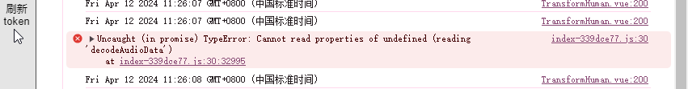

# issue
1. 不能把数字人的装扮切换为当前当前正在使用过的装扮。

2. 身体动画不支持自定义。

3. 只有每次new的时候需要重新获取新的token，不需要做持久化。

4. 如下图，原因是交互前调用了说话。

5. 不能同时启动多个nexthuman项目服务（包括其他服务器上的nexthuman应用等，比如一个本地服务和官方案例不能同时打开）。

6. 打包后的生产环境才不会断点，本地服务必需手动断点才可以。

7. 背景可以直接设置 background-image 就可以使用普通图片。

8. webGL SDK 不能自定义形象，需要定制。